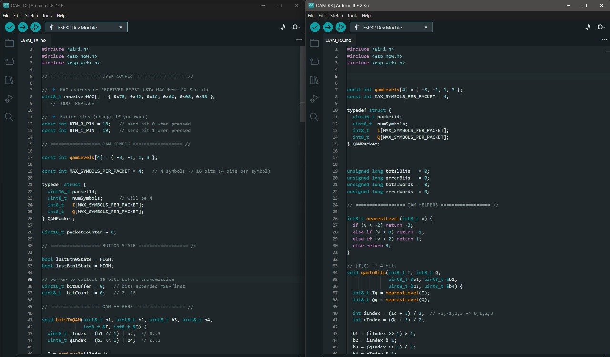

# QAM Modulation and Demodulation using ESP32

---

## Project Overview
This project implements a **16-QAM (Quadrature Amplitude Modulation) digital communication system** using two ESP32 microcontrollers. One ESP32 operates as the **transmitter**, generating QAM symbols from digital input data, while the other functions as the **receiver**, demodulating the received symbols and reconstructing the original bit sequence.

The system uses **ESP-NOW**, a low-latency peer-to-peer wireless protocol, to transmit discrete **In-phase (I)** and **Quadrature (Q)** symbol values. This project provides a practical realization of communication system theory on embedded hardware.

---

## Objectives
- Implement 16-QAM modulation and demodulation on ESP32  
- Understand I–Q representation and constellation mapping  
- Perform wireless data transmission using ESP-NOW  
- Apply nearest-neighbor symbol detection  
- Reconstruct transmitted digital data  
- Provide a base for BER and performance analysis  

---

## System Description

### Transmitter (TX ESP32)
- Binary input provided using two push buttons  
  - Button 0 → binary `0`  
  - Button 1 → binary `1`  
- Bits are appended MSB-first into a 16-bit buffer  
- After collecting 16 bits:  
  - Data is divided into four 4-bit symbols  
  - Each symbol is mapped to a 16-QAM constellation point  
- Each transmitted packet contains:  
  - Packet ID  
  - Number of symbols (4)  
  - I and Q symbol arrays  
- Packets are transmitted using ESP-NOW  

---

### Receiver (RX ESP32)
- Receives packets via ESP-NOW  
- Extracts I and Q values from packets  
- Quantizes received symbols to the nearest constellation level  
- Converts each symbol back into 4 bits  
- Reconstructs the original 16-bit word  
- Displays decoded symbols and bits via serial output  
- Includes a framework for BER and word-error analysis  

---

## QAM Mapping Scheme

### Bit-to-Level Mapping

| Bits | Level |
|------|-------|
| 00   | −3    |
| 01   | −1    |
| 10   | +1    |
| 11   | +3    |

- First two bits map to the **I component**  
- Last two bits map to the **Q component**  
- Each symbol carries **4 bits**  
- One packet carries **4 symbols = 16 bits**  

---

## Software Architecture

### Transmitter Code
- Button edge detection and debouncing  
- Bit buffering and framing  
- 4-bit to I/Q mapping  
- Packet creation and transmission  
- Serial debugging output  

### Receiver Code
- Packet reception and validation  
- Nearest-level symbol quantization  
- I/Q to bit conversion  
- Word reconstruction  
- Debug and performance logging

---

## Source Code

### Transmitter Code
The transmitter ESP32 collects binary input using push buttons, maps the data to 16-QAM symbols, and transmits the symbols wirelessly using ESP-NOW.
`transmitter/tx_qam_esp32.ino`

### Receiver Code
The receiver ESP32 demodulates the received QAM symbols using nearest-neighbor detection, reconstructs the transmitted bit stream, and displays decoded data via the serial monitor.
`receiver/rx_qam_esp32.ino`

---

## Hardware Requirements
- ESP32 Dev Module × 2  
- Push buttons × 2  
- Breadboard and jumper wires  
- USB cables for programming and serial monitoring  

---

## Tools and Technologies
- Arduino IDE  
- ESP-NOW protocol  
- Embedded C/C++  
- Serial Monitor for debugging  

---

## Hardware Setup
The following images show the physical implementation of the transmitter and receiver ESP32 modules used for the QAM communication system.

  
  

---

## Block Diagram
The block diagram illustrates the conceptual flow of data from binary input through QAM modulation, wireless transmission, and demodulation at the receiver.

  

---

## Serial Monitor Output

### Transmitter Output
Shows bit collection, symbol mapping, and packet transmission logs.

  

### Receiver Output
Shows received symbols, quantization, bit reconstruction, and decoded data.

  

---

## Results and Observations
- Successful transmission and reception of 16-bit data frames  
- Accurate reconstruction of transmitted bit sequences  
- Reliable short-range performance  
- Demonstrates feasibility of QAM implementation on low-cost embedded hardware  

---

## Limitations
- Short-range communication only  
- No explicit channel noise modeling  
- Performance limited by timing jitter and quantization  
- Higher-order QAM requires tighter synchronization  

---

## Future Enhancements
- Bit Error Rate (BER) computation  
- AWGN noise modeling  
- Higher-order QAM (64-QAM, 256-QAM)  
- MATLAB/Python constellation visualization  
- Timing synchronization and symbol recovery  

---

## Contributors
- Ballambettu Milan Shankar Bhat (USN: 4NI23EC019)  
- Pranav Maruti Shanbhag (USN: 4NI24EC407)  
- Adithya Y (USN: 4NI23EC005)  
- Anirudha Jayaprakash (USN: 4NI23EC014)  
